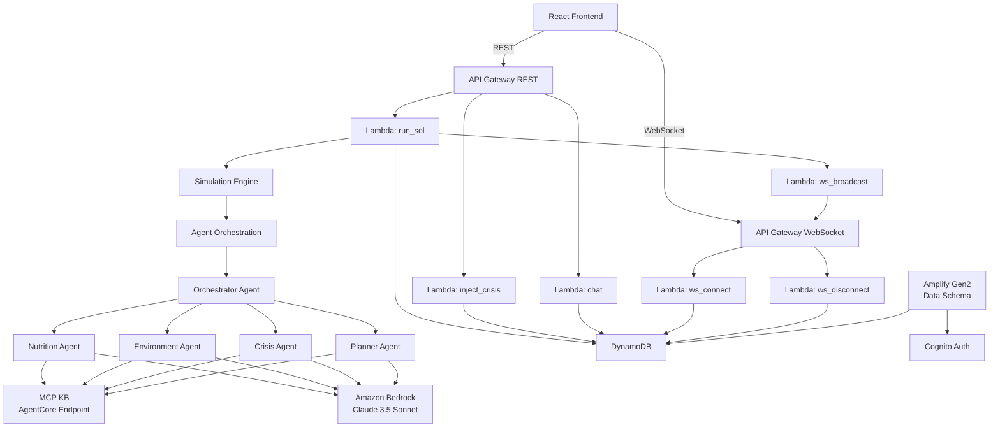

# Design Document — OrbitGrow Backend

## Overview

OrbitGrow is an autonomous Martian greenhouse management backend. It advances a Sol-by-Sol simulation, runs a multi-agent AI system each Sol, exposes a REST API for frontend interaction, and pushes real-time state updates over WebSocket. All agent reasoning is grounded in the Mars Crop Knowledge Base (MCP_KB) accessed via streamable HTTP MCP.

The backend is entirely serverless: Lambda functions handle all compute, DynamoDB stores all state, API Gateway exposes REST and WebSocket endpoints, and Amazon Bedrock (Claude 3.5 Sonnet) powers the agents via the Strands Agents SDK.

### Key Design Decisions

- **Amplify Gen2 for schema + auth**: The six core data models are defined in the Amplify Gen2 schema so the frontend gets generated TypeScript types and a typed Data client for reads. Lambda functions write directly via boto3.
- **Direct DynamoDB for WebSocket connections**: The `ws_connections` table uses a custom partition key (`connection_id`) not compatible with Amplify's auto-ID model, so it is managed outside Amplify via CDK/SAM.
- **Simulation runs inside `run_sol` Lambda**: All nine simulation steps execute synchronously in a single Lambda invocation. This keeps the state machine simple and avoids distributed coordination.
- **Agents run sequentially inside `run_sol`**: Orchestrator calls sub-agents in order (Nutrition → Environment → Crisis → Planner) and collects their reports before writing the DailyMissionReport.
- **MCP KB accessed via streamable HTTP**: All agents share a single `mcp_client.py` module that connects to the AgentCore MCP endpoint with a cached fallback.

---

## Architecture



### Request Flow — POST /run-sol

1. Frontend calls `POST /run-sol`
2. `run_sol` Lambda executes all 9 simulation steps
3. Agents run inside step 8 (Orchestrator → sub-agents → DailyMissionReport)
4. Step 9 writes all state to DynamoDB
5. `ws_broadcast` Lambda pushes updated state to all connected WebSocket clients
6. Lambda returns HTTP 200 with updated state

---

## Components and Interfaces

### Lambda Functions

#### `run_sol/handler.py`
```
POST /run-sol
Request:  {} (empty body)
Response 200: {
  mission_state: MissionState,
  environment_state: EnvironmentState,
  nutrition_ledger: NutritionLedger,
  sol_reports: SolReport
}
Response 500: { message: str, sol: int }
```

#### `inject_crisis/handler.py`
```
POST /inject-crisis
Request:  { type: CrisisType }
Response 200: { injected_crisis: CrisisType, mission_state: MissionState }
Response 400: { message: str }
```

#### `chat/handler.py`
```
POST /chat
Request:  { message: str }  # 1–2000 chars
Response 200: { response: str, reasoning: str }
Response 400: { message: str }
Response 503: { message: str }
```

#### `ws_connect/handler.py`
```
WebSocket $connect
Stores connection_id in ws_connections DynamoDB table
Returns 200
```

#### `ws_disconnect/handler.py`
```
WebSocket $disconnect
Removes connection_id from ws_connections DynamoDB table
Returns 200
```

#### `ws_broadcast` (invoked internally by run_sol)
```
Input: { mission_state, environment_state, nutrition_ledger, crises_active }
Iterates ws_connections table, posts to each connection via API Gateway Management API
Removes stale connection IDs on GoneException
```

### Agent Interfaces

All agents are Python classes using the Strands Agents SDK. They share `mcp_client.py` for KB access.

#### `orchestrator.py` — `OrchestratorAgent`
```python
def run(sol: int, mission_context: dict) -> DailyMissionReport
```
Invokes sub-agents in sequence, synthesizes DailyMissionReport, writes to `sol_reports`.

#### `nutrition_agent.py` — `NutritionAgent`
```python
def run(sol: int, nutrition_ledger: dict) -> NutritionReport
```
Returns `{ coverage_score, kcal_produced, protein_g, crew_health_statuses, deficit_summary }`.

#### `environment_agent.py` — `EnvironmentAgent`
```python
def run(sol: int, environment_state: dict) -> EnvironmentReport
```
Returns `{ sensor_readings, setpoint_adjustments, reasoning }`.

#### `crisis_agent.py` — `CrisisAgent`
```python
def run(sol: int, crises_active: list[str]) -> CrisisReport
```
Returns `{ crises_handled, actions_taken, recovery_timeline_sols, reasoning }`.

#### `planner_agent.py` — `PlannerAgent`
```python
def run(nutrition_report: NutritionReport, environment_report: EnvironmentReport, crisis_report: CrisisReport) -> PlantingPlan
```
Returns `{ plot_assignments, rationale, projected_coverage_score_next_sol }`.

#### `mcp_client.py` — `MCPClient`
```python
def query(document_id: str, query: str) -> dict
```
Connects to `https://kb-start-hack-gateway-buyjtibfpg.gateway.bedrock-agentcore.us-east-2.amazonaws.com/mcp` via streamable HTTP. Falls back to cached values on failure, sets `kb_fallback: True` in response.

### Amplify Gen2 Data Schema (`amplify/data/resource.ts`)

Replaces the placeholder `Todo` model with six models. Auth: `allow.authenticated().to(['read'])` for frontend reads; Lambda functions write via IAM role with direct DynamoDB access (boto3).

---

## Data Models

### DynamoDB Table Design

All Amplify-managed tables use Amplify's auto-generated `id` (UUID) as the primary key. Secondary access patterns use GSIs. The `ws_connections` table is managed outside Amplify.

---

### `MissionState` (Amplify model → `MissionState` DynamoDB table)

Single record. Accessed by `pk = "MISSION"` via a GSI on a `pk` field, or simply fetched as the first/only record.

| Field | Type | Notes |
|---|---|---|
| `id` | String (PK) | Amplify auto-ID; fixed value `"MISSION"` on init |
| `current_sol` | Int | ≥ 0 |
| `phase` | Enum | `nominal` \| `crisis` \| `recovery` |
| `last_updated` | AWSDateTime | ISO 8601 |

Phase transition rules:
- Any active crisis → `"crisis"`
- No crisis + previous was `"crisis"` → `"recovery"`
- No crisis + `"nominal"` or `"recovery"` for 3 consecutive Sols → `"nominal"`

---

### `GreenhousePlot` (Amplify model → `GreenhousePlot` DynamoDB table)

20 records. `plot_id` is the natural key (e.g. `PLOT#A#1`).

| Field | Type | Notes |
|---|---|---|
| `id` | String (PK) | Amplify auto-ID |
| `plot_id` | String | e.g. `PLOT#A#1`; GSI partition key |
| `crop` | Enum | `potato` \| `beans` \| `lettuce` \| `radish` \| `herbs` |
| `planted_sol` | Int | |
| `harvest_sol` | Int | |
| `area_m2` | Float | |
| `health` | Float | 0.0–1.0, clamped |
| `stress_flags` | [String] | e.g. `["disease", "radiation"]` |

Seed distribution (Sol 0): 9 potato, 5 beans, 4 lettuce, 1 radish, 1 herbs. All `health = 1.0`, `stress_flags = []`.

---

### `SolReport` (Amplify model → `SolReport` DynamoDB table)

One record per Sol.

| Field | Type | Notes |
|---|---|---|
| `id` | String (PK) | Amplify auto-ID |
| `sol` | Int | GSI partition key |
| `nutrition_score` | Float | 0–100 |
| `kcal_produced` | Float | |
| `protein_g` | Float | |
| `water_efficiency` | Float | |
| `energy_used` | Float | |
| `agent_decisions` | AWSJSON | Array of agent decision objects |
| `crises_active` | [String] | Empty list if no crises |

---

### `NutritionLedger` (Amplify model → `NutritionLedger` DynamoDB table)

One record per Sol.

| Field | Type | Notes |
|---|---|---|
| `id` | String (PK) | Amplify auto-ID |
| `sol` | Int | GSI partition key |
| `kcal` | Float | |
| `protein_g` | Float | |
| `vitamin_a` | Float | |
| `vitamin_c` | Float | |
| `vitamin_k` | Float | |
| `folate` | Float | |
| `coverage_score` | Float | 0–100, clamped; formula: `((kcal/12000)*0.40 + (protein_g/450)*0.35 + (micronutrient_composite/target)*0.25) * 100` |

---

### `CrewHealth` (Amplify model → `CrewHealth` DynamoDB table)

4 records per Sol (one per astronaut).

| Field | Type | Notes |
|---|---|---|
| `id` | String (PK) | Amplify auto-ID |
| `astronaut` | Enum | `commander` \| `scientist` \| `engineer` \| `pilot` |
| `sol` | Int | GSI partition key |
| `kcal_received` | Float | |
| `protein_g` | Float | |
| `vitamin_a` | Float | |
| `vitamin_c` | Float | |
| `vitamin_k` | Float | |
| `folate` | Float | |
| `health_score` | Float | 0–100; starts at 100 on Sol 0 |
| `deficit_flags` | [String] | e.g. `["protein_low", "vitamin_c_deficient"]` |

Health score rules:
- All targets met → +1 per Sol (max 100)
- Each active deficit flag → −2 per Sol
- Clamped to [0, 100]
- Score < 60 → Crew_Health_Emergency flag in DailyMissionReport

---

### `EnvironmentState` (Amplify model → `EnvironmentState` DynamoDB table)

One record per Sol.

| Field | Type | Notes |
|---|---|---|
| `id` | String (PK) | Amplify auto-ID |
| `sol` | Int | GSI partition key |
| `temperature_c` | Float | Internal; drift ±1.5°C, [10, 35] |
| `humidity_pct` | Float | Internal; drift ±3%, [30, 95] |
| `co2_ppm` | Float | Internal; drift ±80 ppm, [400, 2000] |
| `light_umol` | Float | Internal; drift ±20 µmol, [200, 600] |
| `water_efficiency_pct` | Float | Internal; drift ±1.5%, [50, 99] |
| `energy_used_pct` | Float | Internal; drift ±2%, [30, 100] |
| `external_temp_c` | Float | Mars external; drift ±8°C, [−125, +20] |
| `dust_storm_index` | Float | Mars external; drift ±0.05, [0.0, 1.0] |
| `radiation_msv` | Float | Mars external; drift ±0.05, [0.1, 0.7] |

Sol 0 seed values: `temperature_c=22, humidity_pct=65, co2_ppm=1200, light_umol=400, water_efficiency_pct=92, energy_used_pct=60, external_temp_c=-60, dust_storm_index=0.0, radiation_msv=0.3`.

---

### `ws_connections` (Direct DynamoDB — not Amplify-managed)

| Field | Type | Notes |
|---|---|---|
| `connection_id` | String (PK) | API Gateway WebSocket connection ID |
| `connected_at` | String | ISO 8601 timestamp |

---

### Simulation Engine — Step Sequence

The `run_sol` Lambda executes these steps in order:

```
Step 1: Mars external drift (external_temp_c, dust_storm_index, radiation_msv)
Step 2: Internal sensor drift (temperature_c, humidity_pct, co2_ppm, light_umol, water_efficiency_pct, energy_used_pct)
Step 3: Cascade effects (dust→light, cold→energy, radiation→crop health)
Step 4: Probabilistic crisis roll (5 independent checks)
Step 5: Crop growth (advance age, stress multipliers, yield at harvest)
Step 6: Nutritional output (sum harvests → kcal/protein/vitamins)
Step 7: Resource consumption (water, energy per crop type)
Step 8: Run all agents (Orchestrator → Nutrition → Environment → Crisis → Planner)
Step 9: Write state snapshot (all DynamoDB writes, then WebSocket broadcast)
```

Drift formula: `new_value = clamp(current + random(−drift, +drift), hard_min, hard_max)`

Cascade rules:
- `dust_storm_index > 0.5` → `light_umol -= (dust_storm_index - 0.5) * 2 * light_umol`
- `external_temp_c < -80` → `energy_used_pct += (-80 - external_temp_c) * 0.1`
- `radiation_msv > 0.6` → `health -= 0.02` on all plots without `"radiation_shielding"` in `stress_flags`

Crisis probabilities per Sol:

| Crisis | Probability | Effect |
|---|---|---|
| `water_recycling_failure` | 0.8% | `water_efficiency_pct = 65` |
| `energy_budget_cut` | 0.5% | `energy_used_pct = min(energy_used_pct + 40, 100)` |
| `temperature_spike` | 1.2% | `temperature_c = 30` |
| `disease_outbreak` | 0.6% | `health -= 0.3` on random zone; add `"disease"` to `stress_flags` |
| `co2_imbalance` | 0.9% | `co2_ppm = 1900` |

---

## Correctness Properties


*A property is a characteristic or behavior that should hold true across all valid executions of a system — essentially, a formal statement about what the system should do. Properties serve as the bridge between human-readable specifications and machine-verifiable correctness guarantees.*

### Property 1: Sol counter monotonically increments

*For any* mission state with `current_sol = N`, after one call to `run_sol`, the resulting `current_sol` must equal `N + 1`.

**Validates: Requirements 1.3**

---

### Property 2: Phase transitions follow crisis presence

*For any* Sol execution, if `crises_active` is non-empty then `mission_state.phase` must be `"crisis"`. If `crises_active` is empty and the previous phase was `"crisis"`, then `mission_state.phase` must be `"recovery"`.

**Validates: Requirements 1.4, 1.5**

---

### Property 3: Nominal phase restoration after 3 quiet Sols

*For any* mission that has been in `"recovery"` or `"nominal"` phase with no active crises for 3 consecutive Sols, the phase must be `"nominal"` on the 4th Sol.

**Validates: Requirements 1.6**

---

### Property 4: Plot health is always in [0.0, 1.0]

*For any* greenhouse plot after any number of Sol advancements, `health` must satisfy `0.0 ≤ health ≤ 1.0`.

**Validates: Requirements 2.4, 2.5**

---

### Property 5: Harvested plot resets correctly

*For any* plot whose age reaches `harvest_sol - planted_sol`, after the harvest step the plot must have a new `planted_sol`, a new `harvest_sol > planted_sol`, and `health = 1.0`.

**Validates: Requirements 2.6, 11.4**

---

### Property 6: Exactly one SolReport written per Sol

*For any* Sol N that completes via `run_sol`, there must be exactly one `SolReport` record with `sol = N` in DynamoDB after the call.

**Validates: Requirements 3.1**

---

### Property 7: SolReport agent_decisions contains all agent outputs

*For any* completed Sol, the `agent_decisions` array in the `SolReport` must contain at least one entry from each of the four agents: Nutrition, Environment, Crisis, and Planner.

**Validates: Requirements 3.2, 17.1, 17.2**

---

### Property 8: Nutritional coverage score formula is correct and clamped

*For any* `kcal`, `protein_g`, and `micronutrient_composite` values, the computed `coverage_score` must equal `min(((kcal/12000)*0.40 + (protein_g/450)*0.35 + (micronutrient_composite/target)*0.25) * 100, 100.0)`.

**Validates: Requirements 4.2, 4.3, 18.4**

---

### Property 9: Exactly 4 CrewHealth records written per Sol

*For any* Sol N that completes, there must be exactly 4 `CrewHealth` records with `sol = N` — one for each of `commander`, `scientist`, `engineer`, `pilot`.

**Validates: Requirements 5.1**

---

### Property 10: Health score update rule

*For any* astronaut on any Sol, if all nutritional targets are met then `health_score` increases by 1 (capped at 100); if there are K active deficit flags then `health_score` decreases by `2 * K` (floored at 0).

**Validates: Requirements 5.2, 5.3, 5.4**

---

### Property 11: Crew health emergency flag when score < 60

*For any* Sol where any astronaut's `health_score` drops below 60, the `DailyMissionReport` in `sol_reports.agent_decisions` must contain `crew_health_emergency: true` and identify the affected astronaut(s).

**Validates: Requirements 5.5, 17.3**

---

### Property 12: Nutritional output distributed equally across crew

*For any* Sol, each astronaut's `kcal_received` must equal `nutrition_ledger.kcal / 4` (within floating-point tolerance).

**Validates: Requirements 5.6**

---

### Property 13: Drift keeps all sensor values within hard bounds

*For any* sensor variable after any number of drift applications, the value must remain within its defined `[hard_min, hard_max]` interval:
- `external_temp_c` ∈ [−125, +20]
- `dust_storm_index` ∈ [0.0, 1.0]
- `radiation_msv` ∈ [0.1, 0.7]
- `temperature_c` ∈ [10, 35]
- `humidity_pct` ∈ [30, 95]
- `co2_ppm` ∈ [400, 2000]
- `light_umol` ∈ [200, 600]
- `water_efficiency_pct` ∈ [50, 99]
- `energy_used_pct` ∈ [30, 100]

**Validates: Requirements 7.1, 7.2, 7.3, 8.1, 8.2, 8.3, 8.4, 8.5, 8.6**

---

### Property 14: Dust cascade reduces light proportionally

*For any* environment state where `dust_storm_index > 0.5` after drift, the resulting `light_umol` must equal `original_light - (dust_storm_index - 0.5) * 2 * original_light`, then clamped to [200, 600].

**Validates: Requirements 9.1**

---

### Property 15: Cold cascade increases energy load

*For any* environment state where `external_temp_c < -80` after drift, the resulting `energy_used_pct` must equal `original_energy + (-80 - external_temp_c) * 0.1`, then clamped to [30, 100].

**Validates: Requirements 9.2**

---

### Property 16: Crisis effects match specification

*For any* Sol where a crisis fires (probabilistically or via injection), the resulting state changes must exactly match the defined effects: `water_recycling_failure` → `water_efficiency_pct = 65`; `energy_budget_cut` → `energy_used_pct = min(prev + 40, 100)`; `temperature_spike` → `temperature_c = 30`; `disease_outbreak` → `health -= 0.3` on affected zone plots + `"disease"` in `stress_flags`; `co2_imbalance` → `co2_ppm = 1900`.

**Validates: Requirements 10.3, 10.4, 10.5, 10.6, 10.7, 14.2**

---

### Property 17: Fired crises appear in crises_active

*For any* Sol where one or more crises fire, each fired crisis type must appear in `sol_reports.crises_active` for that Sol.

**Validates: Requirements 10.8, 14.3**

---

### Property 18: Yield calculation is area × base_yield × health

*For any* plot at harvest, the computed yield must equal `area_m2 * base_yield_per_m2 * health` where `base_yield_per_m2` is sourced from MCP_KB.

**Validates: Requirements 11.3**

---

### Property 19: Nutritional totals aggregate all harvests

*For any* Sol, the `kcal` value in `nutrition_ledger` must equal the sum of `kcal` contributions from every plot harvested during that Sol.

**Validates: Requirements 12.1, 12.2**

---

### Property 20: Chat input validation rejects out-of-range messages

*For any* `message` string that is empty or has length > 2000 characters, `POST /chat` must return HTTP 400.

**Validates: Requirements 15.4**

---

### Property 21: WebSocket connection round-trip

*For any* client that connects to the WebSocket API, its `connection_id` must be present in the `ws_connections` DynamoDB table; after disconnection, the `connection_id` must be absent.

**Validates: Requirements 16.2, 16.3**

---

### Property 22: Stale WebSocket connections are cleaned up on broadcast

*For any* broadcast attempt where a connection ID is stale (GoneException), that connection ID must be removed from `ws_connections` and the broadcast must continue to remaining connections.

**Validates: Requirements 16.5**

---

### Property 23: Planner adjusts allocation on deficit

*For any* Sol where a protein deficit is active, the PlantingPlan's beans allocation must be at least 5 percentage points higher than the baseline (~25%). For any Sol where a kcal deficit is active, the potato allocation must be at least 5 percentage points higher than the baseline (~45%).

**Validates: Requirements 21.4, 21.5**

---

### Property 24: MCP fallback sets kb_fallback flag

*For any* agent invocation where the MCP_KB endpoint is unreachable, the agent's report must contain `kb_fallback: true` and the agent must use cached values rather than failing.

**Validates: Requirements 22.5**

---

### Property 25: Initialization idempotency

*For any* DynamoDB state that already contains Sol 0 records, running initialization again must overwrite Sol 0 records without deleting records from Sol 1 or later.

**Validates: Requirements 23.5**

---

## Error Handling

### Lambda Error Strategy

All Lambda handlers wrap their logic in a top-level try/except. Unhandled exceptions are caught, logged to CloudWatch, and returned as structured error responses.

```python
try:
    result = run_simulation_step(event)
    return { "statusCode": 200, "body": json.dumps(result) }
except Exception as e:
    logger.exception("run_sol failed at sol %d", current_sol)
    return {
        "statusCode": 500,
        "body": json.dumps({ "message": str(e), "sol": current_sol })
    }
```

### MCP KB Fallback

`mcp_client.py` maintains an in-memory cache of the last successful KB response per document ID. On connection failure or timeout (10s), it returns the cached value and sets `kb_fallback: True`. If no cache exists (cold start with unreachable KB), it raises `KBUnavailableError` which the agent catches and handles gracefully with hardcoded defaults.

```python
KB_CACHE: dict[str, dict] = {}

def query(document_id: str, query: str) -> dict:
    try:
        result = _call_mcp_endpoint(document_id, query)
        KB_CACHE[document_id] = result
        return { **result, "kb_fallback": False }
    except Exception:
        logger.warning("MCP KB unreachable, using cache for %s", document_id)
        cached = KB_CACHE.get(document_id, HARDCODED_DEFAULTS.get(document_id, {}))
        return { **cached, "kb_fallback": True }
```

### WebSocket Broadcast Error Handling

When broadcasting, stale connections raise `GoneException` from the API Gateway Management API. These are caught per-connection, the connection ID is deleted from DynamoDB, and broadcasting continues to remaining connections.

### inject-crisis Validation

The `inject_crisis` handler validates the `type` field against the known set of 5 crisis types before applying any state changes. Unknown types return HTTP 400 immediately.

### Chat Timeout

The `chat` Lambda sets a 30-second timeout on the Orchestrator Agent invocation. If the agent does not respond within 30 seconds, the handler returns HTTP 503.

---

## Testing Strategy

### Dual Testing Approach

Both unit tests and property-based tests are required. They are complementary:
- Unit tests catch concrete bugs in specific scenarios and verify integration points
- Property-based tests verify universal correctness across the full input space

### Property-Based Testing

**Library**: `hypothesis` (Python) — the standard PBT library for Python, integrates well with pytest.

Install: `pip install hypothesis pytest`

Each property-based test must:
- Run a minimum of 100 iterations (configured via `@settings(max_examples=100)`)
- Include a comment referencing the design property it validates
- Use `@given` decorators with appropriate strategies

Tag format in test comments:
```python
# Feature: orbitgrow-backend, Property N: <property_text>
```

Example:
```python
from hypothesis import given, settings, strategies as st

# Feature: orbitgrow-backend, Property 13: Drift keeps all sensor values within hard bounds
@given(
    current=st.floats(min_value=-125, max_value=20),
    delta=st.floats(min_value=-8, max_value=8)
)
@settings(max_examples=100)
def test_external_temp_drift_bounds(current, delta):
    result = apply_drift(current, delta, hard_min=-125, hard_max=20)
    assert -125 <= result <= 20
```

Properties to implement as property-based tests (one test per property):
- Property 1: Sol counter increment
- Property 4: Plot health bounds [0.0, 1.0]
- Property 8: Coverage score formula and clamp
- Property 10: Health score update rule
- Property 13: All sensor drift bounds
- Property 14: Dust cascade formula
- Property 15: Cold cascade formula
- Property 16: Crisis effects on state
- Property 18: Yield calculation formula
- Property 19: Nutritional totals aggregation
- Property 20: Chat input validation
- Property 23: Planner deficit-driven reallocation
- Property 24: MCP fallback flag

### Unit Tests

Unit tests focus on specific examples, integration points, and edge cases. Use `pytest`.

Key unit test scenarios:
- Sol 0 initialization: verify all seed values match spec exactly (Properties 1.2, 2.2, 2.3, 6.2)
- Phase transitions: nominal → crisis → recovery → nominal sequence
- Crisis injection: each of the 5 crisis types produces the correct state change
- WebSocket connect/disconnect round-trip (Property 21)
- Stale connection cleanup during broadcast (Property 22)
- `POST /run-sol` returns correct HTTP 200 response shape
- `POST /run-sol` returns HTTP 500 on simulated DynamoDB failure
- `POST /inject-crisis` returns HTTP 400 for unknown crisis type
- `POST /chat` returns HTTP 400 for empty message and message > 2000 chars
- `POST /chat` returns HTTP 503 on agent timeout
- Harvest triggers plot reset with health=1.0
- Crew health emergency flag appears when any astronaut score < 60
- Nutritional output split equally across 4 astronauts

### Test File Structure

```
OrbitGrow/
├── tests/
│   ├── unit/
│   │   ├── test_simulation_engine.py
│   │   ├── test_crisis_effects.py
│   │   ├── test_api_handlers.py
│   │   ├── test_agents.py
│   │   └── test_initialization.py
│   └── property/
│       ├── test_drift_bounds.py        # Property 13
│       ├── test_health_invariants.py   # Properties 4, 10
│       ├── test_nutrition_formulas.py  # Properties 8, 19
│       ├── test_simulation_steps.py    # Properties 1, 14, 15, 16, 18
│       ├── test_api_validation.py      # Property 20
│       └── test_planner.py             # Property 23
```

### Running Tests

```bash
# Unit tests only
pytest tests/unit/ -v

# Property tests (single run, no watch mode)
pytest tests/property/ -v --hypothesis-seed=0

# All tests
pytest tests/ -v
```
